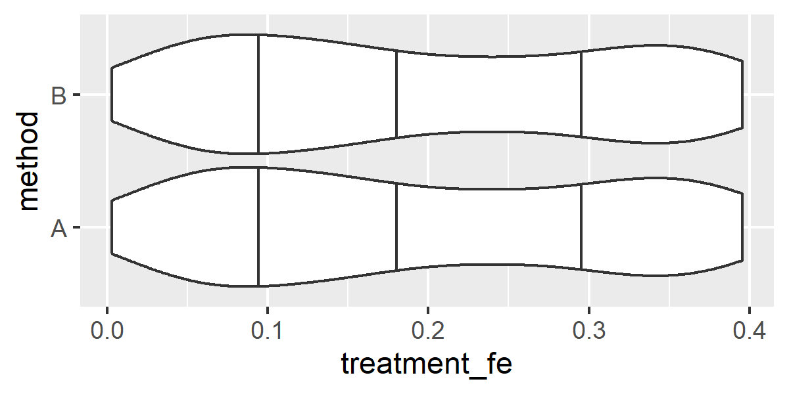
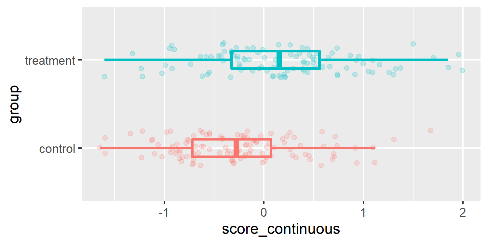
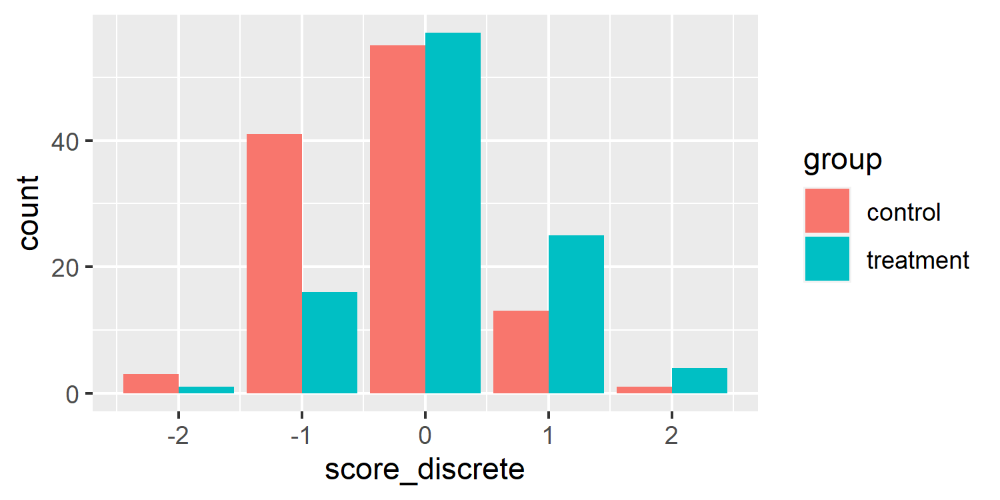
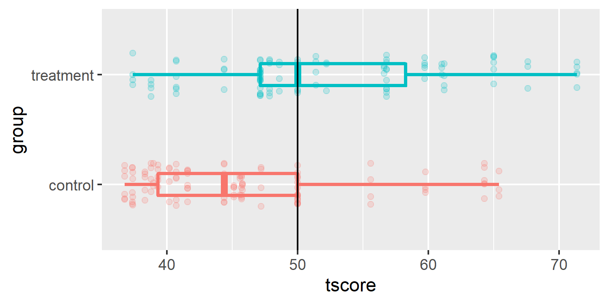
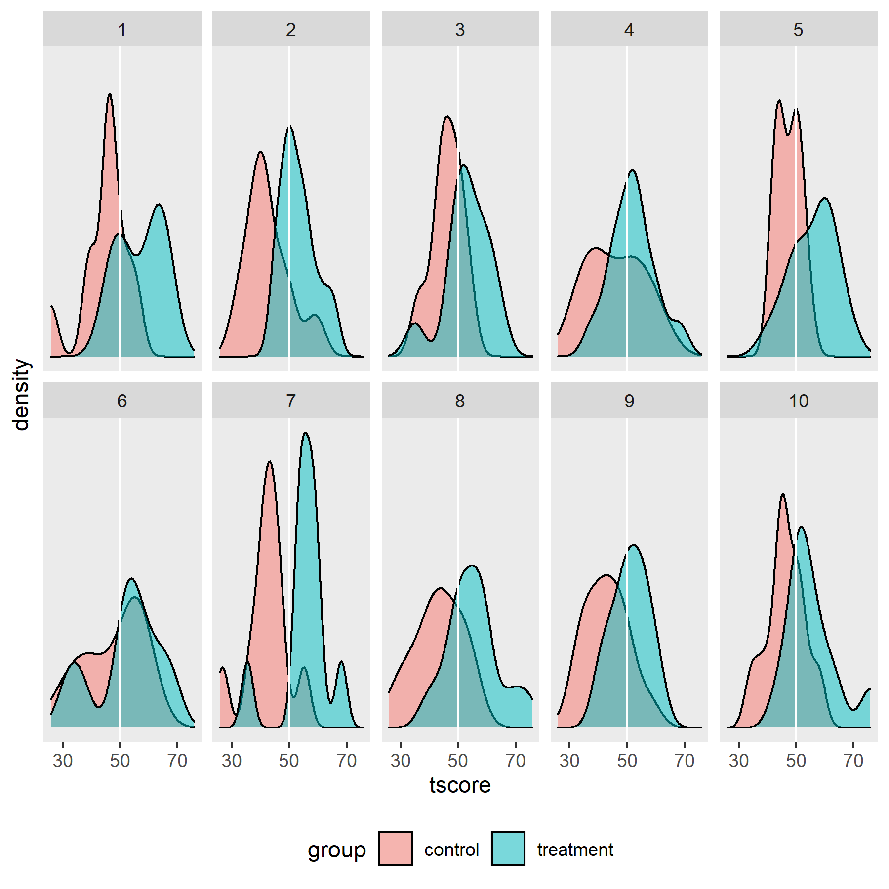

<!-- README.md is generated from README.Rmd. Please edit that file -->

# gasr

<!-- badges: start -->

[](https://lifecycle.r-lib.org/articles/stages.html#experimental)
[](https://CRAN.R-project.org/package=gasr)
<!-- badges: end -->

R functions for working with and simulating goal attainment scaling
data.

## Installation

``` r
#install.packages("remotes")
remotes::install_github("taylordunn/gasr")
```

## Simulating data

The data simulation process is modularized as follows:

1.  Simulate a number of subjects and assign to groups with
    `sim_subjects()`.
2.  For each subject, simulate a number of goals with `sim_goals()`.
3.  For each goal, simulate a treatment effect with
    `sim_treatment_effect()`.
4.  For each goal, simulate a goal weight with `sim_goal_weights()`.
5.  Get continuous latent goal scores by adding up the fixed and random
    effects.
6.  Get discrete observed goal scores by applying thresholds with
    `discretize_from_thresholds()`.

For example, simulate 50 subjects, randomly allocated to “treatment” and
“control” groups with equal probability:

``` r
library(gasr)
library(tidyverse, quietly = TRUE)
#> -- Attaching packages --------------------------------------- tidyverse 1.3.1 --
#> v ggplot2 3.3.3     v purrr   0.3.4
#> v tibble  3.1.2     v dplyr   1.0.6
#> v tidyr   1.1.3     v stringr 1.4.0
#> v readr   1.4.0     v forcats 0.5.1
#> -- Conflicts ------------------------------------------ tidyverse_conflicts() --
#> x dplyr::filter() masks stats::filter()
#> x dplyr::lag()    masks stats::lag()

gas_data <- sim_subjects(
  n_subjects = 50,
  group_allocation = list(control = 0.5, treatment = 0.5)
)
glimpse(gas_data)
#> Rows: 50
#> Columns: 3
#> $ subject_id <chr> "S01", "S02", "S03", "S04", "S05", "S06", "S07", "S08", "S0~
#> $ subject_re <dbl> -0.33488827, -0.05404165, 0.12604985, -0.17719606, 0.428864~
#> $ group      <fct> control, treatment, control, treatment, control, control, t~
```

Add between 3 and 6 goals to each subject:

``` r
gas_data <- gas_data %>%
  sim_goals(n_goals_range = c(3, 6))
glimpse(gas_data)
#> Rows: 50
#> Columns: 5
#> $ subject_id <chr> "S01", "S02", "S03", "S04", "S05", "S06", "S07", "S08", "S0~
#> $ subject_re <dbl> -0.33488827, -0.05404165, 0.12604985, -0.17719606, 0.428864~
#> $ group      <fct> control, treatment, control, treatment, control, control, t~
#> $ n_goals    <int> 5, 6, 4, 6, 6, 4, 3, 4, 4, 4, 4, 6, 3, 6, 6, 5, 4, 6, 5, 3,~
#> $ goals      <list> [<tbl_df[5 x 2]>], [<tbl_df[6 x 2]>], [<tbl_df[4 x 2]>], [~
```

Note that `goals` is returned as a list column, so that the data frame
keeps the same number of rows (one row per subject). The goals can be
unnested with `tidyr` to return a data frame with one row per goal:

``` r
gas_data %>%
  unnest(goals) %>%
  glimpse()
#> Rows: 237
#> Columns: 6
#> $ subject_id <chr> "S01", "S01", "S01", "S01", "S01", "S02", "S02", "S02", "S0~
#> $ subject_re <dbl> -0.33488827, -0.33488827, -0.33488827, -0.33488827, -0.3348~
#> $ group      <fct> control, control, control, control, control, treatment, tre~
#> $ n_goals    <int> 5, 5, 5, 5, 5, 6, 6, 6, 6, 6, 6, 4, 4, 4, 4, 6, 6, 6, 6, 6,~
#> $ goal_num   <int> 1, 2, 3, 4, 5, 1, 2, 3, 4, 5, 6, 1, 2, 3, 4, 1, 2, 3, 4, 5,~
#> $ goal_re    <dbl> 0.54680009, -0.58785816, -0.09704970, -0.91633247, 0.826465~
```

A randomly sampled treatment effect can be added to each goal. This
function can be applied two ways. Method A keeps the data nested, and
applies the function to the `goals` list column using `purrr`:

``` r
set.seed(2)
gas_data_nested <- gas_data %>%
  mutate(
    goals = map(
      goals,
      ~sim_treatment_effect(., delta = 0.2) 
    )
  )
glimpse(gas_data_nested)
#> Rows: 50
#> Columns: 5
#> $ subject_id <chr> "S01", "S02", "S03", "S04", "S05", "S06", "S07", "S08", "S0~
#> $ subject_re <dbl> -0.33488827, -0.05404165, 0.12604985, -0.17719606, 0.428864~
#> $ group      <fct> control, treatment, control, treatment, control, control, t~
#> $ n_goals    <int> 5, 6, 4, 6, 6, 4, 3, 4, 4, 4, 4, 6, 3, 6, 6, 5, 4, 6, 5, 3,~
#> $ goals      <list> [<tbl_df[5 x 3]>], [<tbl_df[6 x 3]>], [<tbl_df[4 x 3]>], [~
```

Method B is to `unnest`, `group_by` subject, and apply:

``` r
set.seed(2)
gas_data <- gas_data %>%
  unnest(goals) %>%
  group_by(subject_id) %>%
  sim_treatment_effect(delta = 0.2) %>%
  ungroup()
glimpse(gas_data)
#> Rows: 237
#> Columns: 7
#> $ subject_id   <chr> "S01", "S01", "S01", "S01", "S01", "S02", "S02", "S02", "~
#> $ subject_re   <dbl> -0.33488827, -0.33488827, -0.33488827, -0.33488827, -0.33~
#> $ group        <fct> control, control, control, control, control, treatment, t~
#> $ n_goals      <int> 5, 5, 5, 5, 5, 6, 6, 6, 6, 6, 6, 4, 4, 4, 4, 6, 6, 6, 6, ~
#> $ goal_num     <int> 1, 2, 3, 4, 5, 1, 2, 3, 4, 5, 6, 1, 2, 3, 4, 1, 2, 3, 4, ~
#> $ goal_re      <dbl> 0.54680009, -0.58785816, -0.09704970, -0.91633247, 0.8264~
#> $ treatment_fe <dbl> 0.07395290, 0.28094961, 0.22933053, 0.06722077, 0.3775357~
```

Note that these two methods produce the same results because we gave
them the same random seed:

``` r
bind_rows(
  A = gas_data_nested %>% unnest(goals),
  B = gas_data,
  .id = "method"
) %>%
  ggplot(aes(x = treatment_fe, y = method)) +
  geom_violin(draw_quantiles = c(0.25, 0.5, 0.75))
```



Goal weights are applied the same way as treatment effects:

``` r
gas_data <- gas_data %>%
  group_by(subject_id) %>%
  sim_goal_weights(weight_type = "preference" ) %>%
  ungroup()
glimpse(gas_data)
#> Rows: 237
#> Columns: 8
#> $ subject_id   <chr> "S01", "S01", "S01", "S01", "S01", "S02", "S02", "S02", "~
#> $ subject_re   <dbl> -0.33488827, -0.33488827, -0.33488827, -0.33488827, -0.33~
#> $ group        <fct> control, control, control, control, control, treatment, t~
#> $ n_goals      <int> 5, 5, 5, 5, 5, 6, 6, 6, 6, 6, 6, 4, 4, 4, 4, 6, 6, 6, 6, ~
#> $ goal_num     <int> 1, 2, 3, 4, 5, 1, 2, 3, 4, 5, 6, 1, 2, 3, 4, 1, 2, 3, 4, ~
#> $ goal_re      <dbl> 0.54680009, -0.58785816, -0.09704970, -0.91633247, 0.8264~
#> $ treatment_fe <dbl> 0.07395290, 0.28094961, 0.22933053, 0.06722077, 0.3775357~
#> $ goal_weight  <int> 4, 5, 3, 1, 2, 3, 1, 2, 4, 6, 5, 3, 2, 1, 4, 6, 5, 2, 4, ~
```

There are a few different options of goal weights available, which are
explained in the function documentation (`?sim_goal_weights`). The
“preference” weights here randomly apply integer weights from 1 to the
number of goals per subject. For instance, this subject with 5 goals:

``` r
gas_data %>%
  filter(subject_id == "S01") %>%
  select(n_goals, goal_num, goal_weight)
#> # A tibble: 5 x 3
#>   n_goals goal_num goal_weight
#>     <int>    <int>       <int>
#> 1       5        1           4
#> 2       5        2           5
#> 3       5        3           3
#> 4       5        4           1
#> 5       5        5           2
```

The next step is to apply all of the fixed and random effects to get a
total latent score for each goal:

``` r
gas_data <- gas_data %>%
  mutate(
    score_continuous = ifelse(group == "treatment", treatment_fe, 0) +
      subject_re + goal_re
  )
glimpse(gas_data)
#> Rows: 237
#> Columns: 9
#> $ subject_id       <chr> "S01", "S01", "S01", "S01", "S01", "S02", "S02", "S02~
#> $ subject_re       <dbl> -0.33488827, -0.33488827, -0.33488827, -0.33488827, -~
#> $ group            <fct> control, control, control, control, control, treatmen~
#> $ n_goals          <int> 5, 5, 5, 5, 5, 6, 6, 6, 6, 6, 6, 4, 4, 4, 4, 6, 6, 6,~
#> $ goal_num         <int> 1, 2, 3, 4, 5, 1, 2, 3, 4, 5, 6, 1, 2, 3, 4, 1, 2, 3,~
#> $ goal_re          <dbl> 0.54680009, -0.58785816, -0.09704970, -0.91633247, 0.~
#> $ treatment_fe     <dbl> 0.07395290, 0.28094961, 0.22933053, 0.06722077, 0.377~
#> $ goal_weight      <int> 4, 5, 3, 1, 2, 3, 1, 2, 4, 6, 5, 3, 2, 1, 4, 6, 5, 2,~
#> $ score_continuous <dbl> 0.2119118160, -0.9227464335, -0.4319379778, -1.251220~

gas_data %>%
  ggplot(aes(y = group, x = score_continuous, color = group)) +
  geom_jitter(width = 0, height = 0.2, alpha = 0.2) +
  geom_boxplot(outlier.shape = NA, fill = NA, width = 0.2, size = 1) +
  theme(legend.position = "none")
```



As a latent variable, this continuous score is not actually measured.
Rather a discretized goal score (usually a 5-point scale) is the
observed variable. Use the `create_thresholds()` function to create
equally spaced thresholds on the latent variable score:

``` r
thresh <- create_thresholds(n_levels = 5)
thresh
#> [1] -Inf -1.5 -0.5  0.5  1.5  Inf
```

Then apply those weights manually with `cut()`, or with the convenience
function `discretize_from_thresholds()`:

``` r
gas_data <- gas_data %>%
  mutate(
    score_discrete = discretize_from_thresholds(score_continuous, thresh)
  )
gas_data %>%
  ggplot(aes(x = score_discrete, fill = group)) +
  geom_bar(position = "dodge")
```



There is then a `calc_tscore()` function to compute an aggregate goal
score based on the formula proposed by (Kiresuk and Sherman 1968):

``` r
gas_data <- gas_data %>%
  group_by(subject_id) %>%
  mutate(tscore = calc_tscore(score_discrete, goal_weight)) %>%
  ungroup()
gas_data %>%
  ggplot(aes(y = group, x = tscore, color = group)) +
  geom_jitter(width = 0, height = 0.2, alpha = 0.2) +
  geom_boxplot(outlier.shape = NA, fill = NA, width = 0.2, size = 1) +
  theme(legend.position = "none") +
  geom_vline(xintercept = 50)
```



All of these steps are packaged into a function with sensible defaults
which simulates a single trial:

``` r
d <- sim_trial()
glimpse(d)
#> Rows: 174
#> Columns: 11
#> $ subject_id       <chr> "S01", "S01", "S01", "S01", "S02", "S02", "S02", "S02~
#> $ subject_re       <dbl> -0.08565973, -0.08565973, -0.08565973, -0.08565973, 0~
#> $ group            <fct> treatment, treatment, treatment, treatment, treatment~
#> $ n_goals          <int> 4, 4, 4, 4, 6, 6, 6, 6, 6, 6, 4, 4, 4, 4, 5, 5, 5, 5,~
#> $ goal_num         <int> 1, 2, 3, 4, 1, 2, 3, 4, 5, 6, 1, 2, 3, 4, 1, 2, 3, 4,~
#> $ goal_re          <dbl> 0.22383904, 0.08748841, 0.19362061, -0.64444722, 0.11~
#> $ treatment_fe     <dbl> 0.591142829, 0.139487903, 0.369644185, 0.496644788, 0~
#> $ goal_weight      <dbl> 1, 1, 1, 1, 1, 1, 1, 1, 1, 1, 1, 1, 1, 1, 1, 1, 1, 1,~
#> $ score_continuous <dbl> 0.72932213, 0.14131658, 0.47760506, -0.23346217, 1.19~
#> $ score_discrete   <dbl> 1, 0, 0, 0, 1, 1, 1, 1, 2, 2, 0, 1, 1, 0, 1, 1, 1, 0,~
#> $ tscore           <dbl> 53.62738, 53.62738, 53.62738, 53.62738, 70.65591, 70.~
```

Those defaults are listed below:

``` r
formals(sim_trial)
#> $n_subjects
#> [1] 40
#> 
#> $sigma_u
#> [1] 0.5
#> 
#> $group_allocation
#> list(control = 0.5, treatment = 0.5)
#> 
#> $random_allocation
#> [1] TRUE
#> 
#> $n_goals
#> NULL
#> 
#> $n_goals_range
#> c(3, 6)
#> 
#> $n_goals_prob
#> NULL
#> 
#> $sigma_e
#> [1] 0.5
#> 
#> $delta
#> [1] 0.3
#> 
#> $weight_type
#> [1] "unweighted"
#> 
#> $n_levels
#> [1] 5
#> 
#> $score_dist
#> [1] "norm"
#> 
#> $centre
#> [1] 0
```

## Simulation workflow

The recommended workflow for running many simulations of GAS trials is
as follows:

1.  Choose your trial parameters, e.g.
    -   Number of subjects `n_subjects`
    -   Group allocation `group_allocation`
    -   Treatment effect `delta`
2.  Choose GAS parameters
    -   Number of goals per subject: `n_goals`, `n_goals_range`, or
        `n_goals_prob`
    -   Goal weights `weight_type`
    -   Attainment level thresholds `thresh`
3.  Choose simulation parameters
    -   Set random seed via `set.seed()` for reproducible results
    -   Number of trials to simulate `n_sim`
4.  Wrap these choices in a custom function to run it `n_sim` times

For the first two steps, the `sim_trial()` function can be used as a
shortcut. For instance, if we want to simulate 20 subjects with 3 goals
and a treatment effect of 0.5:

``` r
sim_trial(n_subjects = 20, n_goals = 3, delta = 0.5) %>%
  glimpse()
#> Rows: 60
#> Columns: 11
#> $ subject_id       <chr> "S01", "S01", "S01", "S02", "S02", "S02", "S03", "S03~
#> $ subject_re       <dbl> -0.55753591, -0.55753591, -0.55753591, -0.05710919, -~
#> $ group            <fct> treatment, treatment, treatment, control, control, co~
#> $ n_goals          <dbl> 3, 3, 3, 3, 3, 3, 3, 3, 3, 3, 3, 3, 3, 3, 3, 3, 3, 3,~
#> $ goal_num         <int> 1, 2, 3, 1, 2, 3, 1, 2, 3, 1, 2, 3, 1, 2, 3, 1, 2, 3,~
#> $ goal_re          <dbl> -0.10167264, 0.39003476, -0.49797173, 0.63681266, 0.1~
#> $ treatment_fe     <dbl> 0.557580325, 0.058427635, 0.201604024, 0.820417159, 0~
#> $ goal_weight      <dbl> 1, 1, 1, 1, 1, 1, 1, 1, 1, 1, 1, 1, 1, 1, 1, 1, 1, 1,~
#> $ score_continuous <dbl> -0.10162823, -0.10907352, -0.85390362, 0.57970347, 0.~
#> $ score_discrete   <dbl> 0, 0, -1, 1, 0, 0, 1, -1, 0, 0, -1, -1, 0, 0, 0, 1, 0~
#> $ tscore           <dbl> 45.43565, 45.43565, 45.43565, 54.56435, 54.56435, 54.~
```

Then step 3 involves just a few extra lines of code to set the seed and
run it `n_sim` times:

``` r
set.seed(15)

n_sims <- 10
sims1 <- tibble(
  sim = 1:n_sims,
  data = map(
    sim,
    ~sim_trial(n_subjects = 20, delta = 0.3)
  )
)
glimpse(sims1)
#> Rows: 10
#> Columns: 2
#> $ sim  <int> 1, 2, 3, 4, 5, 6, 7, 8, 9, 10
#> $ data <list> [<tbl_df[91 x 11]>], [<tbl_df[91 x 11]>], [<tbl_df[91 x 11]>], [<~
```

This returns a row per simulation, with the data nested in the `data`
column.

Step 4, writing a custom function, is not required, but highly
recommended, because it allows quick adjustment of key parameters. For
example, if we just want to vary the number of subjects and the
treatment effect (leaving all other options the same/default), we would
write a function similar to:

``` r
run_simulations <- function(seed, n_sim, n_subjects, delta) {
  set.seed(seed)
  
  tibble(
    sim = 1:n_sim,
  ) %>%
    mutate(
      data = map(
        sim,
        ~sim_trial(n_subjects = n_subjects, delta = delta)
      ),
      seed = seed,
      n_subjects = n_subjects, delta = delta
    )
}
```

Then we can run 100 simulation with `n_subjects` = 20 and `delta` = 0.3
(and time it with the `tictoc` package):

``` r
library(tictoc)
tic()
sims2 <- run_simulations(seed = 52, n_sim = 100,
                         n_subjects = 20, delta = 0.3)
toc()
#> 3.07 sec elapsed
```

Here is an example of unnesting and plotting the T-scores of the first
10 simulations:

``` r
sims2 %>%
  unnest(data) %>%
  filter(sim <= 10) %>%
  distinct(sim, n_subjects, delta,
           subject_id, group, tscore) %>%
  ggplot(aes(x = tscore)) +
  geom_density(aes(fill = group), alpha = 0.5) +
  geom_vline(xintercept = 50, color = "white") +
  facet_wrap(~sim, nrow = 2) +
  theme(axis.ticks.y = element_blank(), axis.text.y = element_blank())
```



## Todo

-   Update documentation for `sim_trial`
-   Continue `internal-consistency` vignette
-   Write unit tests
-   Write `power-calculation` vignette

## References

<div id="refs" class="references csl-bib-body hanging-indent">

<div id="ref-Kiresuk1968" class="csl-entry">

Kiresuk, Thomas J, and Robert E Sherman. 1968. “<span
class="nocase">Goal attainment scaling: A general method for evaluating
comprehensive community mental health programs</span>.” *Community
Mental Health Journal* 4 (6): 443–53.
<https://doi.org/10.1007/BF01530764>.

</div>

</div>
